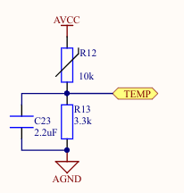

# Thermistors

## Introduction
Thermistors are elements that change their resistance based on the temperature. They can be used to electrically measure temperature. The ODrive itself has thermistors on board near the FETs to ensure that they don't burn themselves out. In addition to this it's possible to connect your own thermistor to measure the temperature of the connected motors. There are two types of thermistors, Negative Temperature Coefficient (NTC) and Positive Temperature Coefficient (PTC). This indicates whether the resistance goes up or down when the temperature goes up or down. The ODrive only supports the NTC type thermistor.

## FET thermistor
The temperature of the onboard FET thermistors can be read out by using the `odrivetool` under `<axis>.fet_thermistor.temp`. The odrive will automatically start current limiting the motor when the `<axis>.fet_thermistor.config.temp_limit_lower` threshold is exceeded and once `<axis>.fet_thermistor.config.temp_limit_upper` is exceeded the ODrive will stop controlling the motor and set an error. The lower and upper threshold can be changed, but this is not recommended.

## Connecting motor thermistors

To use your own thermistors with the ODrive a few things have to be clarified first. The use of your own thermistor requires one analog input pin. Under `<axis>.motor_thermistor.config` the configuration of your own thermistor is available with the following fields:

* `gpio_pin`: The GPIO input in used for this thermistor.
* `poly_coefficient_0` to `poly_coefficient_3`: Coefficient that needs to be set for your specific setup more on that in [Thermistor coefficients](#thermistor-coefficients).
* `temp_limit_lower` and `temp_limit_upper`: Same principle as the FET temperature limits.
* `enabled`: Whether this thermistor is enabled or not.

## Voltage divider circuit
To measure a temperature with a thermistor a voltage divider circuit is used in addition with an ADC. The screenshot below is taken directly from the ODrive schematic.

The way this works is that the thermistor is connected in series with a known resistance value. By connecting an ADC directly after the thermistor the resistance value can be determined. For further information see [Voltage divider](https://en.wikipedia.org/wiki/Voltage_divider). While not strictly necessary, it is a good idea to add a capacitor as shown as well. This will help reduce the effect of electrical noise. A value between 470nF and 4.7uF is recommended, and any voltage rating 4V or higher. Put the capacitor physically close to the ODrive.

To use a thermistor with the ODrive a voltage divider circuit has to be made that uses `VCCA` as the power source with `GNDA` as the ground. The voltage divider output can be connected to a GPIO pin that supports analog input.

## Thermistor coefficients
Every thermistor and voltage divider circuit is different and thus it's necessary to let the ODrive know how to relate a voltage it measures at the GPIO pin to a temperature. The `poly_coefficient_0` to `poly_coefficient_3` under `<axis>.motor_thermistor.config` are used for this. The `odrivetool` has a convenience function `set_motor_thermistor_coeffs(axis, Rload, R_25, Beta, Tmin, Tmax)` which can be used to calculate and set these coefficients.

* `axis`: Which axis do set the motor thermistor coefficients for (`odrv0.axis0` or `odrv0.axis1`).
* `Rload`: The Ohm value of the resistor used in the voltage divider circuit. 
* `R_25`: The resistance of the thermistor when the temperature is 25 degrees celsius. Can usually be found in the datasheet of your thermistor. Can also be measured manually with a multimeter.
* `Beta`: A constant specific to your thermistor. Can be found in the datasheet of your thermistor.
* `Tmin` and `Tmax`: The temperature range that is used to create the coefficients. Make sure to set this range to be wider than what is expected during operation. A good example may be -10 to 150.
